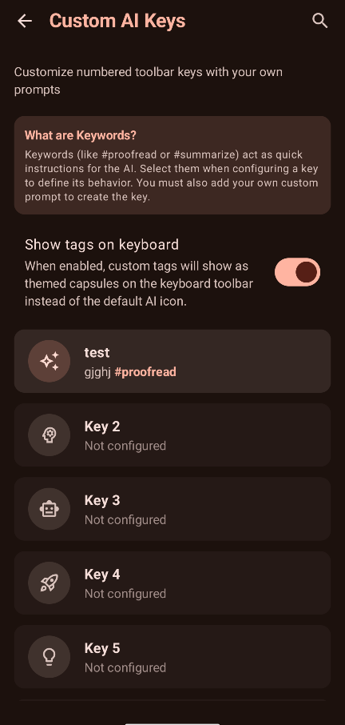
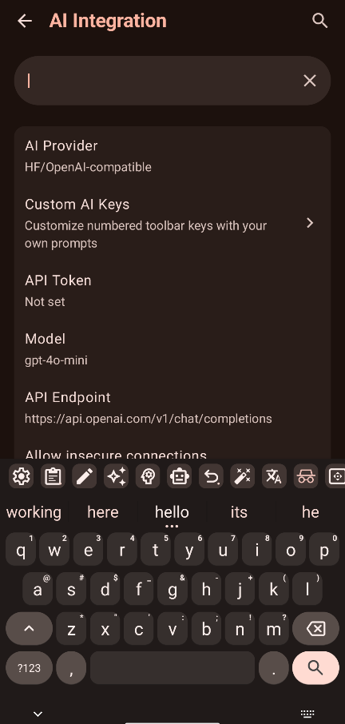
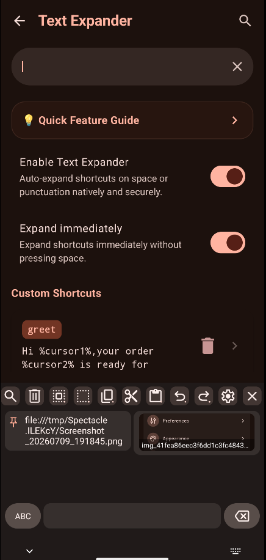
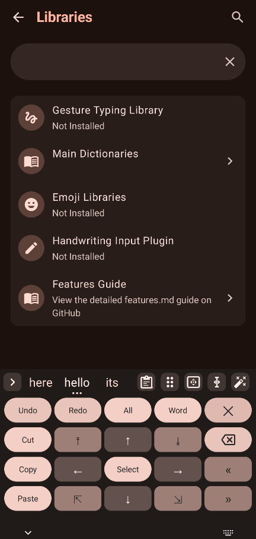
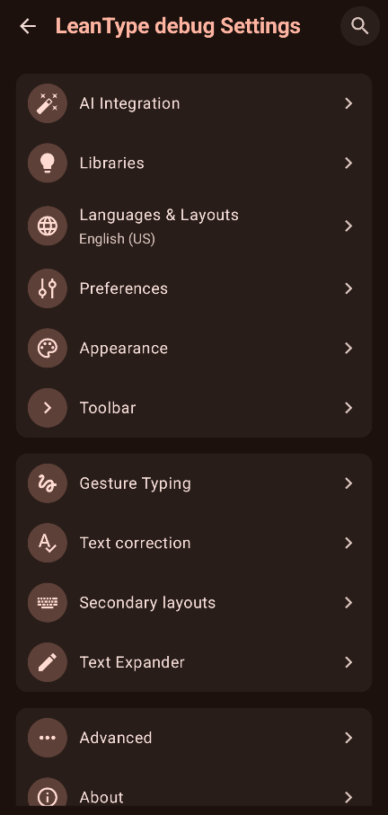

# LeanTypeDual

<picture>
  <source media="(prefers-color-scheme: dark)" srcset="docs/images/leantype_banner_dark.svg">
  <source media="(prefers-color-scheme: light)" srcset="docs/images/leantype_banner_light.svg">
  
</picture>

  

**LeanTypeDual** is a privacy-conscious, customizable keyboard built for **two-thumb typing** with **opt-in AI**. It is a fork of [LeanBitLab/LeanType](https://github.com/LeanBitLab) (which layers AI proofreading & translation on top), itself a fork of [HeliBoard](https://github.com/Helium314/HeliBoard) — the AOSP/OpenBoard-based engine that does dictionaries, layouts, multilingual & glide typing, themes and clipboard history.

The **"Dual"** is **dual-thumb gesture typing**: glide with both thumbs at once and the keyboard fuses the trails into words. On top of that it keeps a private, offline core with opt-in cloud intelligence, and ships in three privacy tiers. It installs as a **distinct app** (`com.asafmah.leantypedual`) so it can run side-by-side with the upstream keyboards.

## What makes LeanTypeDual different

### ✌️ Two-thumb (dual-thumb) typing — the namesake feature
Type with **both thumbs gliding at the same time**: LeanTypeDual aggregates multiple simultaneous gesture trails into a single word (a Nintype-style flow) instead of forcing one-finger-at-a-time swipes. It has a dedicated tuning screen — combining-mode grace timing, tap-promotion, fragment backspace (pop the last swiped fragment), multi-part word recognition, customizable autospace, and an opt-in typing-insight overlay that visualizes the gesture join. *(Gesture typing requires the gesture library — see Download.)*

### On top of that — LeanType's AI layer and quality-of-life features

- **[🤖 Multi-Provider AI](docs/FEATURES.md#supported-ai-providers)** - Proofread using **Gemini**, **Groq** (Llama 3, Mixtral), or **OpenAI-compatible** providers, with dynamic fetching of the latest models.
- **[🛡️ Offline AI (GGUF)](docs/FEATURES.md#5-offline-proofreading-privacy-focused)** - Private, on-device proofreading and translation using local **GGUF models** powered by `llama.cpp` (Offline build only).
- **🌐 AI Translation** - Translate selected text using your chosen provider, with a separate model selector.
- **[✍️ Handwriting Input](docs/FEATURES.md#8-handwriting-input)** - Draw characters directly on a handwriting recognition canvas (Standard version, requires [Leantype-Handwriting-Plugin](https://github.com/LeanBitLab/Leantype-Handwriting-Plugin)).
- **[🧠 Custom AI Keys](docs/FEATURES.md#4-custom-ai-keys--keywords)** - Assign custom prompts, personas (#editor, #proofread), and labels/tags (themed capsules) to 10 customizable toolbar keys.
- **📝 Text Expander** - Shortcut → expansion with dynamic placeholders (`%clipboard%`, `%day%`, `%time12%`, `%cursor%`, lists), regex shortcuts, backspace-to-revert, and a guide.
- **🧠 Smarter learned words** - *graduated trust* keeps a just-learned word below real-dictionary suggestions until you've used it a few times (no premature autocorrect to half-typed words); flag unknown words to **Add** or **Block** them via a Blocklist screen.
- **↩️ Undo word** - a toolbar key that reverts the last committed word back to its suggestion alternatives.
- **🗂️ Per-dictionary control** - enable or disable individual built-in and custom dictionaries.
- **📥 Dynamic Downloader** - Standard builds can download layout dictionaries, emoji dictionaries, and handwriting plugins on demand, keeping the initial app smaller.
- **🪟 Floating Keyboard** - Detach the keyboard into a draggable, resizable window (true OS-level overlay), with an optional persistent mode.
- **⌨️ Dual Toolbar / Split Suggestions** - Split the suggestion strip and toolbar for easier reach.
- **🖱️ Touchpad Mode** - Swipe the spacebar up for a cursor touchpad with sensitivity controls and edge-scroll acceleration, including a full-screen laptop-style mode.
- **✍️ Text editing mode** - A toolbar key opens a text-editing overlay for selection, cursor movement, and clipboard actions.
- **🎨 Modern UI** - "Squircle" key backgrounds, refined icons, and polished aesthetics.
- **🔄 Google Dictionary Import** - Import your personal dictionary words.
- **🔍 Clipboard Search & Undo** - Search clipboard history from the toolbar, undo accidental deletions, and fold pinned items by default.
- **📸 Screenshot Suggestion & Clipboard** - Recently-taken screenshots are offered in the suggestion strip and saved to clipboard history.
- **✉️ Auto-Read OTP** - Incoming one-time codes can appear in the suggestion strip for quick insertion.
- **💾 Selective Backup & Restore** - Backup and restore settings, dictionaries, and AI prompt configuration selectively.
- **🔎 Emoji Search** - Search emojis by name. *Requires loading an Emoji Dictionary.*
- **⚙️ Enhanced Customization** - Force auto-capitalization, fine-grained haptics, distinct incognito icon, reorganized settings, and more.
- **🔒 Privacy Choices** - Choose **Standard** (opt-in AI, handwriting), **Offline** (network hard-disabled, offline GGUF model), or **Offline Lite** (no AI, ~20 MB).

## Screenshots

<table>
  <tr>
    <td></td>
    <td></td>
    <td></td>
    <td></td>
    <td></td>
    <td></td>
  </tr>
</table>

## Download

<table border="0">
  <tr>
    <td align="center" valign="middle">
      
    </td>
    <td align="center" valign="middle">
      
    </td>
  </tr>
</table>

> **⚠️ Note:** F-Droid releases might be delayed or stuck again due to reproducibility verification issues. For the latest version, use GitHub Releases or Obtainium.

### 📦 Choose Your Version

#### 1. Standard Version (`-standard-release.apk`)
*   **Features:** Full suite including **AI Proofreading**, **AI Translation**, **Handwriting Input**, and **Gesture Library Downloader**.
*   **Permissions:** Request `INTERNET` permission (used *only* when you explicitly use AI features, download plugins, or update libraries).
*   **Setup:** Use the built-in downloader for Gesture Typing and Handwriting Input. Configure AI keys in Settings.

#### 2. Offline Version (`-offline-release.apk`)
*   **Features:** All UI/UX enhancements and **Offline Neural Proofreading** (via `llama.cpp` using local **GGUF models**).
*   **Permissions:** **NO INTERNET PERMISSION**. Guaranteed at OS level.
*   **Best For:** Privacy purists.
*   **Manual Setup Required:**
    *   **Gesture Typing:** [Download library manually](https://github.com/erkserkserks/openboard/tree/46fdf2b550035ca69299ce312fa158e7ade36967/app/src/main/jniLibs) and load via *Settings > Gesture typing*.
    *   **Offline AI:** Download GGUF models and load via *Settings > Advanced > GGUF Model (.gguf)*. 👉 **[See Offline Setup Instructions](docs/FEATURES.md#5-offline-proofreading-privacy-focused)**

#### 3. Offline Lite Version (`-offlinelite-release.apk`)
*   **Features:** All UI/UX enhancements but **NO AI FEATURES**.
*   **Permissions:** **NO INTERNET PERMISSION**. Guaranteed at OS level.
*   **Best For:** Minimalists who want a modern keyboard without any AI components (~20MB size).
*   **Manual Setup Required:**
    *   **Gesture Typing:** [Download library manually](https://github.com/erkserkserks/openboard/tree/46fdf2b550035ca69299ce312fa158e7ade36967/app/src/main/jniLibs) and load via *Settings > Gesture typing*.

## Original HeliBoard Features

<ul>
  <li>Add dictionaries for suggestions and spell check</li>
  <li>Customize keyboard themes (style, colors and background image)</li>
  <li>Customize keyboard layouts</li>
  <li>Multilingual typing</li>
  <li>Glide typing (<i>requires library</i>)</li>
  <li>Clipboard history</li>
  <li>One-handed mode</li>
  <li>Split keyboard</li>
  <li>Number pad</li>
  <li>Backup and restore settings</li>
</ul>

For original feature documentation, visit the [HeliBoard Wiki](https://github.com/Helium314/HeliBoard/wiki).

## Setup

### AI Features Setup

LeanType supports multiple AI providers: **Google Gemini**, **Groq**, and **OpenAI-compatible** (OpenRouter, HuggingFace, etc.).

👉 **[Read the Full AI Setup & Features Guide](docs/FEATURES.md)**

**Quick Start:**
1.  Get a free key from [Google AI Studio](https://aistudio.google.com/apikey) (Gemini) or [Groq Console](https://console.groq.com/keys) (Groq).
2.  Copy the API key.
3.  Go to **Settings → AI Integration → Set AI Provider**.
4.  Select your provider and paste the API Token.
5.  Select Model and target language

> [!IMPORTANT]
> **Privacy**: Your input data is sent to the configured provider.
> 👉 **[View Privacy Policies for Providers](docs/FEATURES.md#supported-ai-providers)**

## Contributing

For issues specific to LeanType features, please open an issue in this repository.

For issues with core HeliBoard functionality, please report to the [original HeliBoard repository](https://github.com/Helium314/HeliBoard/issues).

## License

LeanType (as a fork of HeliBoard/OpenBoard) is licensed under **GNU General Public License v3.0**.

See [LICENSE](/LICENSE) file.

## Credits

### Original Projects
- **[HeliBoard](https://github.com/Helium314/HeliBoard)** by Helium314 - The excellent keyboard this fork is based on
- [OpenBoard](https://github.com/openboard-team/openboard)
- [AOSP Keyboard](https://android.googlesource.com/platform/packages/inputmethods/LatinIME/)
- All [HeliBoard Contributors](https://github.com/Helium314/HeliBoard/graphs/contributors)

### This fork
- **LeanTypeDual** — two-thumb typing and the changes in [CHANGELOG.md](CHANGELOG.md), by [AsafMah](https://github.com/AsafMah)
- **[LeanType](https://github.com/LeanBitLab)** (the AI proofreading/translation layer) — by LeanBitLab

## 🛡️ LeanBitLab Ecosystem

Check out our other projects:
👉 **[LeanBitLab Projects](https://github.com/LeanBitLab#-current-projects)**

---

## Support the Development

Building and maintaining privacy-focused, offline AI apps takes time and resources (test devices, server costs, etc.).

If you love LeanTypeDual, please consider supporting the project!

Your support keeps the code **100% Free and Open Source**.

---

*LeanTypeDual • Two-thumb typing • privacy-focused, with opt-in AI*
