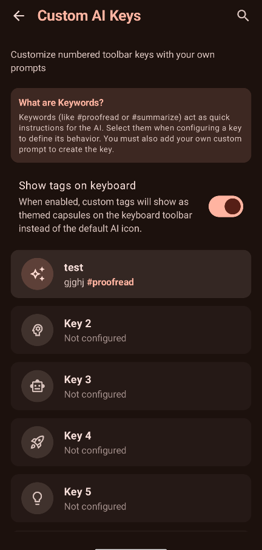
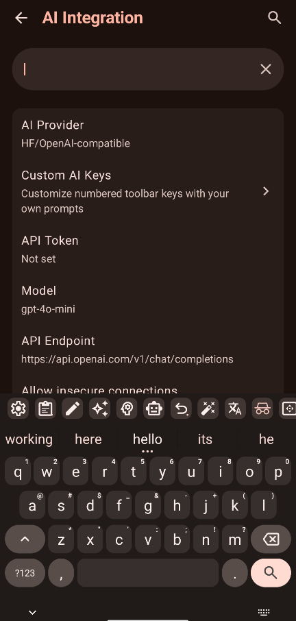
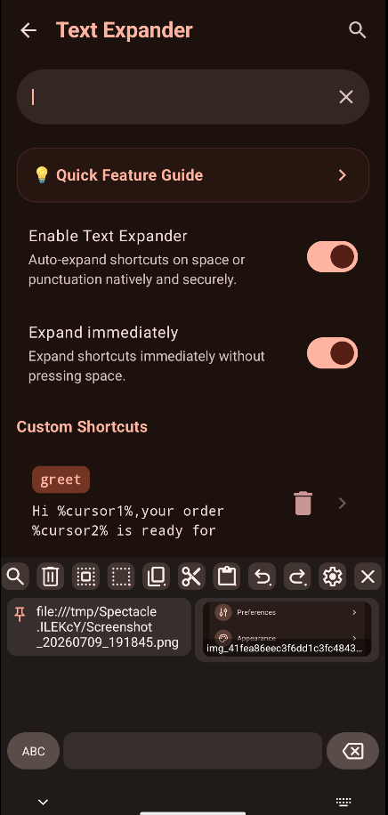
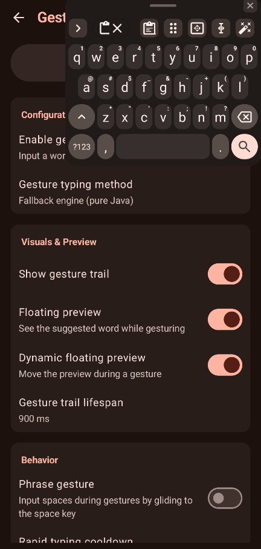
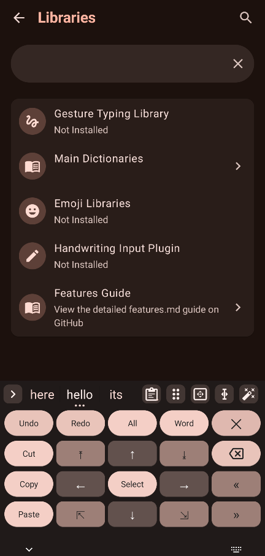
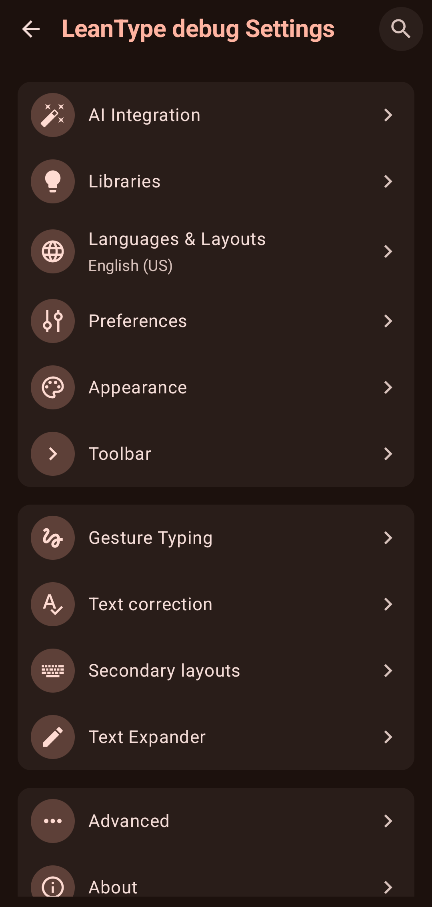

# LeanTypeDual

LeanTypeDual is [AsafMah/LeanType](https://github.com/AsafMah/LeanType), a fork of
[LeanBitLab/LeanType](https://github.com/LeanBitLab/LeanType), which is based on HeliBoard / OpenBoard / AOSP LatinIME.
It installs alongside upstream LeanType as `com.asafmah.leantypedual` (with `.offline` for the offline flavor).
LeanTypeDual releases are available from [this fork](https://github.com/AsafMah/LeanType/releases);
the upstream artwork, documentation, community links, and plugin ecosystem below retain their original provenance.

This source tree is based on upstream commit
`24ecbb0a6503a48965ef99e8958530a9445bb414` ([4.2.9 beta-429-1](https://github.com/LeanBitLab/LeanType/releases/tag/beta-429-1),
a prerelease). Its additions are fork
branding, editable top/bottom-row swipe shortcut menus, and an experimental GIF/sticker
picker with retained-keyboard results, bounded caching and saved media bookmarks,
plus optional temporary Literal typing and focused input-correction fixes.
The backup-restore and custom-layout emoji-search fixes are now upstream-owned,
not duplicate local patches. Fork version `2.0.0` (`6000`) is unchanged; upstream
release numbers below describe the inherited project. The surviving flavors are
Standard (online, including GIF/sticker search) and Offline (no Internet permission).

The beta supplies the web-editor backspace, fast-typing capitalization, Pixel haptics,
delete-key icon, Arabic symbols and landscape `TYPE_NULL` updates. Literal typing,
the fork's expander/contraction fixes and upstream's saved auto-capitalization controls
remain separate features.

The combined picker also retains common-emoji swipe-up defaults, emoji variant pins,
long-press media preview, and reduced-animation controls. These additions coexist with
the beta's typing fixes; see [GIF and sticker search](#gif-and-sticker-search-experimental)
for cache, privacy and provider-term limitations.

Build the network-capable debug app with `.\gradlew.bat :app:assembleStandardDebug`
(JDK 21 and the Android SDK/NDK specified in Gradle). The output is
`app\build\outputs\apk\standard\debug\1-LeanTypeDual_2.0.0-standard-debug.apk`,
using package `com.asafmah.leantypedual.debug` and the local Android debug signer.
Upstream excludes bundled dictionaries: fresh installations need a dictionary
download in Standard, or a manual dictionary import in Offline.
This does not publish a release or install/change the active keyboard.

Enable **Literal typing** through toolbar customization, pin it, or use
`{"label":"literal"}` in a custom JSON layout. It temporarily disables automatic
typing assistance for the current field without changing saved preferences or
learned words. See [the action reference](docs/FEATURES.md#literal-typing) for its
lifetime and exclusions.

<picture>
  <source media="(prefers-color-scheme: dark)" srcset="docs/images/leantype_banner_dark.svg">
  <source media="(prefers-color-scheme: light)" srcset="docs/images/leantype_banner_light.svg">
  
</picture>

**A private, smart, and deeply customizable open-source Android keyboard.**  
*Forked from [LeanType](https://github.com/LeanBitLab/LeanType), based on [HeliBoard](https://github.com/Helium314/HeliBoard) / OpenBoard / AOSP LatinIME.*

[Screenshots](#-screenshots) • [Download APKs](#-download) • [Flavor Comparison](#-flavor-comparison) • [Features](#-features) • [Setup Guide](#-setup-guide) • [Ecosystem](#-ecosystem--plugins) • [Other Projects](https://github.com/LeanBitLab#-android-projects)

---

## 🚀 Overview

**LeanTypeDual** combines the trusted, lightweight, privacy-focused foundation of HeliBoard with modern productivity features: Multi-Provider Cloud, Self-Hosted & Offline AI proofreading, On-Device Whisper Voice Typing, Handwriting Recognition, In-Keyboard Offline Camera & Screenshot OCR, Real-time Inline Math Calculations, Zero-Latency Custom Sound Packs, Smart Toolbar Auto-Spanning, Built-in Self-Updater, and Rich Text Tools, while keeping you in complete control over your data.

---

## 📸 Screenshots

<table>
  <tr>
    <td></td>
    <td></td>
    <td></td>
    <td></td>
    <td></td>
    <td></td>
    <td></td>
    <td></td>
    <td></td>
  </tr>
</table>

---

## 📦 Flavor Comparison

LeanTypeDual is available in two purpose-built flavors designed to match your exact privacy preferences, hardware specifications, and feature requirements:

> [!NOTE]
> **Flavor Consolidation (v4.2.6)**:  
> As announced in v4.2.5, `standardfull` has been completely merged into `standard`; it is no longer a build variant. Neither surviving flavor requests `READ_CONTACTS`, `SYSTEM_ALERT_WINDOW`, or `REQUEST_INSTALL_PACKAGES`. Existing Standard Full installations use Standard updates with the same package identity and signing key.

| Feature / Capability | 🌿 Standard (Recommended) `-standard-release.apk` | 🛡️ Offline `-offline-release.apk` |
| :--- | :---: | :---: |
| **Target Audience** | **Recommended** (F-Droid & Direct users) | Privacy purists & Air-gapped devices |
| **Cloud AI** *(Gemini, Groq, OpenAI)* | ✅ Yes | ❌ No |
| **Offline AI** *(Local GGUF via llama.cpp)* | ❌ No | ✅ **Yes** *(Android 8.0+ via plugin)* |
| **Translation** *(Offline & AI)* | ✅ **Yes** *(Plugin or AI)* | ✅ **Yes** *(via Plugin)* |
| **Voice Typing** *(On-device Whisper)* | ✅ **Yes** *(via plugin)* | ✅ **Yes** *(via plugin)* |
| **Handwriting Input** | ✅ **Yes** *(via plugin)* | ✅ **Yes** *(via plugin)* |
| **OCR Text Extraction** *(Camera & Screenshots)* | ✅ **Yes** *(via plugin)* | ✅ **Yes** *(via plugin)* |
| **Release Update Checker** | ✅ **Yes** *(GitHub Releases / View Release)* | ❌ No |
| **Plugins & Models Setup** | In-app download or File import | Browser download + File import |
| **Internet Permission** | 🌐 Optional *(Cloud AI / Updates)* | 🚫 **None** *(OS-level blocked)* |
| **Package ID** | `com.asafmah.leantypedual` | `com.asafmah.leantypedual.offline` |
| **Min Android Version** | Android 6.0+ *(SDK 23)* | Android 5.0+ *(SDK 21)* |
| **Approximate APK Size** | **~10.8 MB** | **~9.8 MB** |

> [!TIP]
> **APK Installation Notice**: Google Play Protect or your browser may block direct APK installations downloaded from web browsers. If you experience installation issues, install via [Obtainium](https://apps.obtainium.imranr.dev/redirect.html?r=obtainium://add/https://github.com/LeanBitLab/LeanType) or a package manager like [App Manager](https://github.com/MuntashirAkon/AppManager).

---

## ✨ Features

### 🤖 AI Integration & Smart Tools
- **Multi-Provider Cloud & Self-Hosted AI**: Integrated proofreading, grammar correction, and text rewriting powered by **Google Gemini**, **Groq** (Llama 3.3, Mixtral, DeepSeek), **OpenAI**, or any **Self-Hosted local LLM server** (Ollama, LM Studio, LocalAI, vLLM, or custom OpenAI-compatible endpoints).
- **Dynamic Model Fetching**: Automatically fetches and populates the latest available model IDs directly from your cloud or self-hosted provider.
- **🛡️ Offline Neural Proofreading (GGUF)**: Run compact, quantized GGUF language models directly on your device via embedded `llama.cpp`—100% private, zero network access (`offline` flavor).
- **🌐 Multi-Mode In-Keyboard Translation**: Translate text directly into any language without switching apps. Choose between **Offline Translation Plugin** (supported across all flavors), **Built-in Offline Translation (ML Kit)**, or your configured **Cloud / Self-Hosted AI Provider** (Gemini, Groq, OpenAI, Ollama) with seamless fallback.
- **🧠 Custom AI Keys & Capsules**: Assign custom prompts, personas (`#editor`, `#proofread`), and themed tag capsules to 10 customizable toolbar keys.

### 📷 Offline Camera & Screenshot OCR
- **In-Keyboard Camera Viewfinder**: Open a live camera viewfinder directly inside the keyboard to extract printed or handwritten text with 1 tap.
- **Screenshot Suggestion Pill**: Automatically detects newly captured screenshots and displays a compact suggestion pill (`[OCR] [Screenshot] [X]`) for immediate 1-tap text extraction.
- **Advanced Text Cleaners & Formatting**: Clean and format recognized text with options for casing transformations, line joining, dehyphenation, punctuation normalization, bullet/list-marker stripping, whitespace trimming, and noise filtering.
- **Customizable Actions**: Automatic clipboard copying, direct insertion into active text fields, persistent flash toggle, and search indexing.

### 🎙️ Voice & Handwriting Input
- **On-Device Whisper Voice Typing**: High-accuracy speech recognition powered by compact quantized **Whisper models** via the [LeanType Voice Plugin](https://github.com/LeanBitLab/Leantype-Voice-Plugin).
- **Interactive Voice Toolbar**: Real-time waveform audio visualizer, silence detection sensitivity slider, and background keep-alive options.
- **✍️ Handwriting Recognition**: Draw characters or words directly on an expansive writing canvas using the [LeanType Handwriting Plugin](https://github.com/LeanBitLab/Leantype-Handwriting-Plugin) (supported across all flavors), with dedicated settings and in-app/offline model management.

### ⌨️ Layouts, Audio & Typing
- **🎵 Custom Sound Packs & Audio Customization**: Native zero-latency key audio engine with 12+ built-in sound styles (iOS Tap, Mechanical Cherry MX, Thocky Mechanical, Vintage Typewriter, Retro CRT Terminal, Bubble Pop, Soft Velvet, Woodblock Minimal, Acoustic Marimba, Modern Crisp Tick, Sci-Fi, 8-Bit Chiptune Arcade), live sample audition, remote sound pack catalog, and custom `.zip` pack import.
- **👆 Gesture / Glide Typing**: Smooth swipe typing powered by native C++ libraries (`libjni_latinime.so`).
- **📐 Smart Auto-Spanning Toolbar**: Dynamically expands and balances toolbar keys symmetrically to prevent awkward gaps across portrait, landscape, and tablet widths.
- **🧭 Dedicated Text Editing Panel**: Gboard-style precision DPAD arrow navigation, selection mode (Shift + arrows), select word, select all, and editing shortcuts.
- **🖱️ Touchpad Mode**: Swipe up on the spacebar to control the cursor freely across the screen, including full-screen laptop-style touchpad mode.
- **🪟 Native IME Floating Window**: Seamless native IME window architecture with zero sensitive permissions (no `SYSTEM_ALERT_WINDOW`), pass-through background touches, bottom control bar (close, center-drag pill, resize drag handle), multi-touch tracking, zero dead space, and persistent mode memory.
- **⚙️ Per-App Profiles & Compatibility Engine**: Tailor keyboard behavior per application (**Settings → Preferences → App Profiles**)—enable web editor compatibility, automatic incognito, force non-incognito, direct commit mode, symbol composing (preserving underscores `_` in Tasker variables), dialer search field compatibility (`TYPE_NULL`), and custom Enter action overrides.
- **⌨️ First-Class Hardware Keyboard Support**: Full predictive text, auto-correction, candidate selection shortcuts (`1`, `2`, `3`), and D-PAD navigation in emoji palettes for external Bluetooth/USB keyboards, with smart toolbar elevation above the navigation bar.
- **🎨 Advanced Appearance & Key Ergonomics**: Independent corner radius sliders for Normal Keys, Functional Keys (Shift/Backspace), and Action Keys (Enter/Space), adjustable key gaps, customizable padding scales, and distinct Shift/Caps visual state indicators (outline, filled, underlined).
- **⌨️ Dual Toolbar / Split Suggestions**: Option to split suggestions from the quick-action toolbar.
- **🎨 Custom Layout Profiles**: Save up to 5 custom layout profiles with persistent slot index tracking.
- **⌨️ Direct Switch Target IME & Custom Keycodes**: Bind keycode `-10076` to any toolbar key to switch directly to a specific target keyboard (e.g. Japanese, Korean, or Chinese IME). See the [Comprehensive Keycodes & Actions Reference](docs/FEATURES.md#30-comprehensive-keycodes--actions-reference) for the full keycodes catalog.

### 📋 Clipboard & Productivity
- **🔢 Real-Time Inline Math Calculations**: Automatically evaluates mathematical expressions upon typing `=` (e.g. `25*4=`, `500-15%=`, `(12+8)/4=`) and shows the answer directly in the suggestion strip for 1-tap replacement.
- **🔍 Smart Clipboard History & Inline Editing**: Search clips in real-time, swipe right to edit text directly in the toolbar with full gesture cursor/deletion, swipe left to delete with 5s undo, and fold pinned items.
- **📸 Screenshot Suggestions**: Detects recently taken screenshots and offers instant 1-tap sharing via the suggestion strip or clipboard history.
- **📝 Versatile Text Expander**: Built-in shortcut expansion with dynamic variables (`%date%`, `%time%`, `%clipboard%`, `%cursor%`), composable modifier filters (`%clipboard:clean%`, `:singleline`, `:title`, `:slug`, `:upper`, `:replace`), and automatic Wikipedia / research paper citation cleaner.
- **💾 Selective Category Backup & Restore**: Export and restore your data modularly with independent category checkboxes (**Layouts**, **Theme & Custom Backgrounds**, **Dictionaries & Typing History**, **Clipboard History**, and **General Settings**) without all-or-nothing overwrites.
- **🔎 In-Palette Emoji Search**: Search emojis instantly by name or keyword directly within the emoji palette view, powered by locale-aware emoji dictionaries.
- **✉️ Privacy-First OTP Auto-Fill**: Notification-based OTP verification code detection without sensitive SMS permissions, with customizable messaging app selection.
- **📚 Smart Learning & Session Boost**: Adaptive personal dictionary learning threshold (1 to 5 times) and dynamic session word boosting.
- **🚫 Blacklist & Regex Filtering**: Filter offensive words or unwanted suggestions with custom regex pattern support.
- **🔄 Google Dictionary Import**: Seamlessly import personal dictionary words exported from Gboard.
- **🔄 In-App Update Checker**: Direct GitHub release checks with single-version changelogs and 1-tap "View Release" redirection (`standard` flavor).

---

## 📥 Download

<table border="0">
  <tr>
    <td align="center" valign="middle">
      
    </td>
    <td align="center" valign="middle">
      
    </td>
    <td align="center" valign="middle">
      
    </td>
    <td align="center" valign="middle">
      
    </td>
  </tr>
</table>

---

## 🛠️ Setup Guide

### GIF and sticker search (experimental)

In Standard, open the emoji picker and choose **GIFs** or **Stickers**.
Configure your own GIPHY API key in **Advanced settings**; no shared key or account backend is supplied.
Type a query using your active language/custom layout, then press **Search**. Typing alone does not send requests.
Emoji and media results occupy a compact pane **above the retained keyboard**, with Expand/Collapse controls.
The focus button explicitly switches between **Typing in app** and **Typing search query**; results remain visible in both modes.
The docked IME reserves the pane's height rather than drawing over the conversation. Landscape and floating modes limit expansion.
Visible previews animate; choosing an item inserts it and returns to the previous typing layout.
If the field cannot accept the media, **Share** explicitly opens Android's chooser instead. The receiving app controls whether an item appears as an image, animation or native sticker.

**Back** first leaves query editing, then returns to typing. **X** clears the query without searching.
GIPHY receives submitted queries and media requests; LeanType does not add advertising identifiers or action analytics.
Online media is disabled in global or per-app Force Incognito, no-learning and password contexts.
An app's Force Non-Incognito override does not relax these media restrictions.
The Offline flavor shows Emoji only.
Keys are stored separately from exported settings and can be removed in the same preference.
The last successful media results, query, tab and scroll position are restored when reopening the picker.
**Refresh** requests a new result explicitly; ordinary reopening does not rerun a search.
Long press a result for preview and Pin/Unpin controls without inserting it. **Pinned** is a separate,
newest-first collection of up to 200 provider-ID bookmarks, not a permanent offline media archive.
Opening a bookmark reuses fresh cached metadata or fetches that ID; removed items can be unpinned.
Responses marked no-store contribute only an explicitly pinned ID/kind, not persistent descriptive metadata.
**Media options** includes reduced animation and Clear history and cache (bookmarks are retained).
For Emoji, **Pin emoji** lets a tap save the chosen emoji/variant instead of inserting it; long press
a pinned emoji to unpin it. Existing recents and the existing preferred skin-tone setting remain in use.
Local sticker imports and packs are not included.

The result/media cache is separate from receiver-read staging. It uses a one-hour maximum TTL,
up to 64 MiB/64 downloaded files with least-recently-used eviction, finite metadata/history bounds,
and respects shorter HTTP freshness and no-store/no-cache directives. Expired result URLs require an
explicit refresh; bookmarks do not keep files forever. Key replacement/removal purges cache and
media bookmarks, including across process restarts. Private, locked, offline and unavailable-network
contexts do not restore cached media queries/results or initiate provider requests.
Cached data is app-private and excluded from backup, but is not itself encrypted: this application
defaults to device-protected storage and enforces unlock/privacy checks before access.
Selected-media storage is capped at 64 MiB and 64 files. Cleanup protects a selected file for a
one-hour receiver-read window, then removes expired files when the picker is opened or another
item is staged. This is not a guarantee of deletion exactly one hour later, and Android may
reclaim cache storage earlier. The picker rejects new items when the protected store is full.

GIPHY sets [key quotas and access conditions](https://developers.giphy.com/docs/api/quick-start-guide/).
Personal keys do not waive its [API terms](https://support.giphy.com/hc/en-us/articles/360028134111-GIPHY-API-Terms-of-Service)
or [media storage requirements](https://developers.giphy.com/docs/api/best-practices/).
Confirm the applicable conditions for your use, including temporary files needed for Android image sharing.
Caching and bookmark support are experimental implementation choices, **not evidence of approval
from GIPHY**. HTTP cache headers do not replace the provider's contractual terms. Clearing or evicting
the cache never deletes or revokes the independent, unexpired receiver staging files.
The unmodified GIPHY attribution PNGs in `app/src/main/res/drawable-nodpi/` are supplied through
[GIPHY's official attribution archive](https://media.giphy.com/giphy-attribution-marks.zip);
GIPHY retains its trademark rights, and use of those marks is governed by its API terms.

With the Android build toolchain installed, media JVM checks can be run with
`.\gradlew.bat :app:testStandardRunTestsUnitTest --tests "*Media*" --tests "*Giphy*"`.
The legacy GIF decoder uses Android `Movie` JNI that Robolectric cannot supply; its frame-change,
transparency and stop assertions are retained in `MediaLegacyDecoderDeviceTest`. Run it on an
authorized Android device with `.\gradlew.bat :app:connectedStandardDebugAndroidTest
-Pandroid.testInstrumentationRunnerArguments.class=helium314.keyboard.keyboard.media.MediaLegacyDecoderDeviceTest`.
JVM-only verification does not establish APK/native or receiving-app compatibility.

### 1. Cloud & Self-Hosted AI Setup (Gemini / Groq / OpenAI / Ollama)
1. **Cloud API**: Obtain an API key from [Google AI Studio](https://aistudio.google.com/apikey) or [Groq Console](https://console.groq.com/keys).
2. **Self-Hosted AI**: Run [Ollama](https://ollama.com/), [LM Studio](https://lmstudio.ai/), or [LocalAI](https://localai.io/) on your local network (e.g. `http://192.168.1.100:11434/v1`).
3. Open **Settings → AI Integration → Set AI Provider**.
4. Select your provider (or choose **Custom (OpenAI-compatible)** for self-hosted instances), enter your endpoint URL/token, and choose your preferred model and target language.
5. 👉 **[Read the Full AI & Prompts Guide](docs/FEATURES.md)**

### 2. Voice Input Setup (On-Device Whisper AI)
1. Download and install the [LeanType Voice Plugin APK](https://github.com/LeanBitLab/LeanType-Voice-Plugin/releases/latest) on your Android device (installed as a background IPC service).
2. Grant **Microphone permission** to the LeanType Voice Plugin.
3. In LeanTypeDual, open **Settings → Voice typing** (or **Settings → Plugins → Voice**) and tap **Whisper Speech Models**.
4. Download or import your preferred Whisper model (e.g. *Base* ~74 MB recommended).
5. Tap the microphone icon on the keyboard toolbar to start speech-to-text!

### 3. Translation Setup (Offline & Online)
1. **Online Flavor (`Standard`)**: Open **Settings → Translation** and tap **Download Plugin** to install the [LeanType Translation Plugin](https://github.com/LeanBitLab/LeanType-Translation-Plugin/releases/latest) automatically.
2. **Offline Flavor (`Offline`)**: Download `translation_plugin-arm64-v8a.apk` from [GitHub Releases](https://github.com/LeanBitLab/LeanType-Translation-Plugin/releases/latest) and load it in **Settings → Plugins → Translation**.
3. Download or import your required language translation models (~30 MB per language).
4. Tap the **Translate** icon on the keyboard toolbar to translate selected text or input fields instantly.

### 4. Handwriting Recognition Setup
1. **Online Flavor (`Standard`)**: Open **Settings → Handwriting** and tap **Download Plugin** to fetch the [LeanType Handwriting Plugin](https://github.com/LeanBitLab/Leantype-Handwriting-Plugin/releases/latest).
2. **Offline Flavor (`Offline`)**: Download `handwriting_plugin-arm64-v8a.apk` from [GitHub Releases](https://github.com/LeanBitLab/Leantype-Handwriting-Plugin/releases/latest) and load it in **Settings → Plugins → Handwriting**.
3. Download or import handwriting recognition models for your languages.
4. Tap the **Handwriting key** on the toolbar or long-press spacebar to draw characters on the writing canvas.

### 5. Offline AI Setup (Local GGUF Models)
1. Download `ai_plugin-arm64-v8a.apk` (or `ai_plugin-x86_64.apk`) from the [LeanType Offline AI Plugin Releases](https://github.com/LeanBitLab/LeanType-Offline-AI-Plugin/releases/latest).
2. In LeanTypeDual (`offline` build), navigate to **Settings → Plugins → Offline AI** and tap **Load Offline AI plugin** to load the `.apk`.
3. Download a compatible GGUF model (e.g. `Qwen2.5-0.5B-Instruct-Q4_K_M.gguf` or `Llama-3.2-1B-Instruct-Q4_K_M.gguf`).
4. In LeanTypeDual, navigate to **Settings → Advanced → GGUF Model (.gguf)** and select the model file from storage.

### 6. Dictionaries & Gesture Typing Setup
1. **Dictionaries**: With unbundled dictionaries in v4.1.6, open **Settings → Dictionaries** (or tap the dictionary icon on the toolbar when missing) to download or import your language dictionary (`.dict`).
2. **Gesture Typing**: In online builds, open **Settings → Gesture typing** to download the gesture library automatically. In offline builds, [download the library](https://github.com/erkserkserks/openboard/tree/46fdf2b550035ca69299ce312fa158e7ade36967/app/src/main/jniLibs) and load via *Settings → Gesture typing → Load gesture library*.

### 7. Offline Camera & Screenshot OCR Setup
1. **Online Flavors**: Open **Settings → OCR & Text Extraction** (or **Settings → Plugins → OCR**) and tap **Download Plugin** to install the [LeanType OCR Plugin](https://github.com/LeanBitLab/LeanType-Ocr-Plugin/releases/latest).
2. **Offline Flavors**: Download `ocr_plugin.apk` from [GitHub Releases](https://github.com/LeanBitLab/LeanType-Ocr-Plugin/releases/latest) and load it in **Settings → Plugins → OCR**.
3. Tap the **Camera / OCR** icon on the toolbar to open the in-keyboard scanner or take a screenshot to see the instant suggestion pill.

---

## 🧩 Ecosystem & Plugins

Expand LeanTypeDual with upstream LeanType companion plugins:

| Plugin | Repository | Description |
| :--- | :--- | :--- |
| 🧠 **Offline AI Plugin** | [LeanBitLab/LeanType-Offline-AI-Plugin](https://github.com/LeanBitLab/LeanType-Offline-AI-Plugin) | Dynamic on-device GGUF / llama.cpp proofreading & LLM engine |
| 🎙️ **Voice Plugin** | [LeanBitLab/Leantype-Voice-Plugin](https://github.com/LeanBitLab/Leantype-Voice-Plugin) | On-device Whisper speech-to-text engine |
| 📷 **OCR Plugin** | [LeanBitLab/LeanType-Ocr-Plugin](https://github.com/LeanBitLab/LeanType-Ocr-Plugin) | On-device ML Kit camera viewfinder & screenshot text extraction |
| 🌐 **Translation Plugin** | [LeanBitLab/LeanType-Translation-Plugin](https://github.com/LeanBitLab/LeanType-Translation-Plugin) | Dedicated on-device translation provider engine |
| ✍️ **Handwriting Plugin** | [LeanBitLab/Leantype-Handwriting-Plugin](https://github.com/LeanBitLab/Leantype-Handwriting-Plugin) | ML Kit Digital Ink canvas recognition engine |
| 🎵 **Sound Packs** | [LeanBitLab/LeanType-Sound-Packs](https://github.com/LeanBitLab/LeanType-Sound-Packs) | Synthesized and physical modeling keypress sound packs |
| 🎨 **Community Themes** | [GitHub: `leantype-theme`](https://github.com/topics/leantype-theme) | Browse and share custom color themes |

---

## 📱 More Android Projects by LeanBitLab

Discover our complete suite of privacy-first, open-source Android applications and utilities:  
👉 **[Explore All LeanBitLab Android Projects](https://github.com/LeanBitLab#-android-projects)**

---

## 🤝 Community & Contributing

- **Bug Reports & Feature Requests**: [Open a GitHub Issue](https://github.com/LeanBitLab/LeanType/issues)
- **Discussion & Support**: [GitHub Discussions](https://github.com/LeanBitLab/LeanType/discussions)
- **Official Telegram Channel**: [@LeanBitLab](https://t.me/leanbitlab)
- **Theme Creators**: Tag your repository with `leantype-theme` to appear in our theme catalog.

---

## 💖 Support the Project

Building and maintaining privacy-first, on-device AI and keyboard technologies requires continuous hardware testing, compute for model optimization, and development time.

If LeanType improves your daily typing workflow, please consider sponsoring our work!

  
  &nbsp;&nbsp;
  

---

## 📜 Credits & Acknowledgments

- **[HeliBoard](https://github.com/Helium314/HeliBoard)** by Helium314 — the foundational keyboard project
- **[OpenBoard](https://github.com/openboard-team/openboard)** & **[AOSP LatinIME](https://android.googlesource.com/platform/packages/inputmethods/LatinIME/)**
- **[llama.cpp](https://github.com/ggerganov/llama.cpp)** & **[llamacpp-kotlin](https://github.com/ljcamargo/llamacpp-kotlin)** — on-device local LLM execution
- **[whisper.cpp](https://github.com/ggerganov/whisper.cpp)** — on-device speech recognition
- All [contributors](https://github.com/LeanBitLab/LeanType/graphs/contributors) and open-source supporters!

---

## ⚖️ License

LeanTypeDual is licensed under the **GNU General Public License v3.0 (GPL-3.0)**.
See the [LICENSE](LICENSE) file for details.
